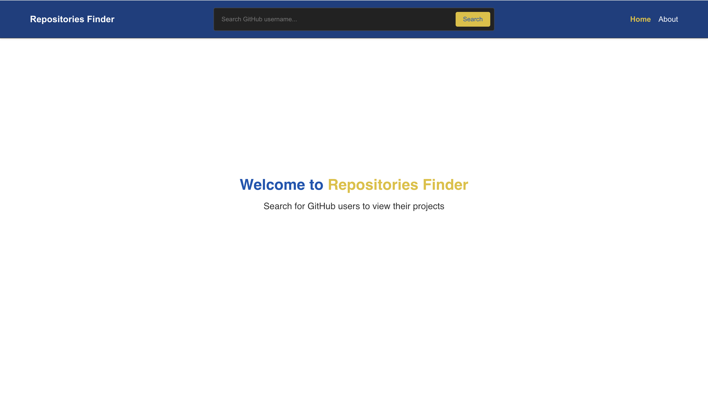
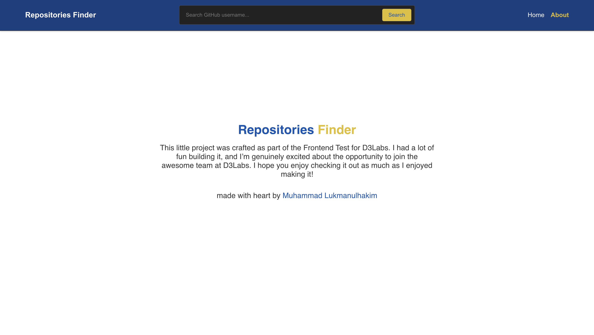
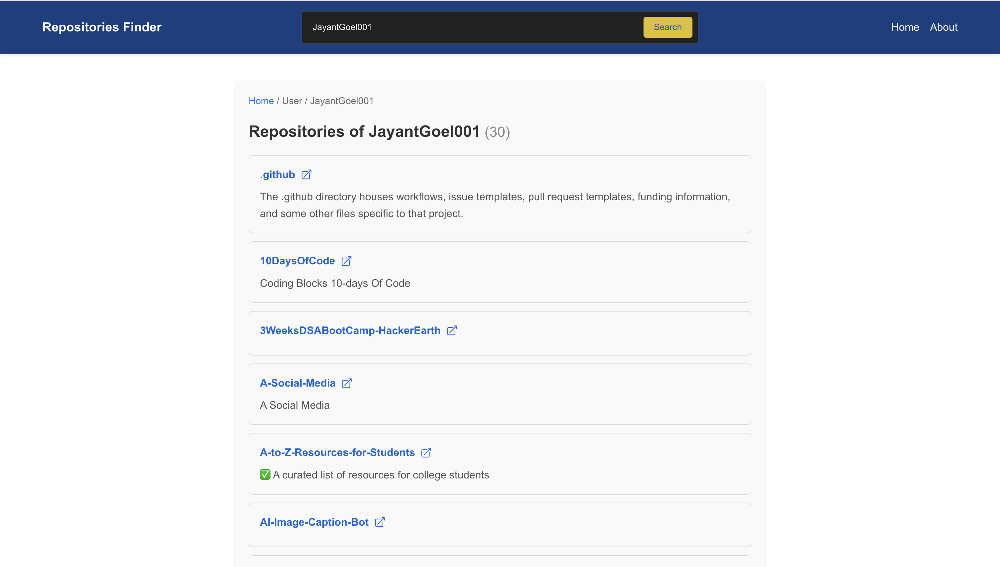
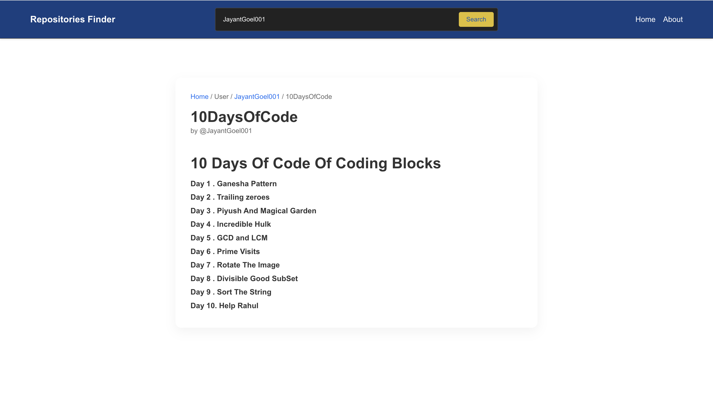
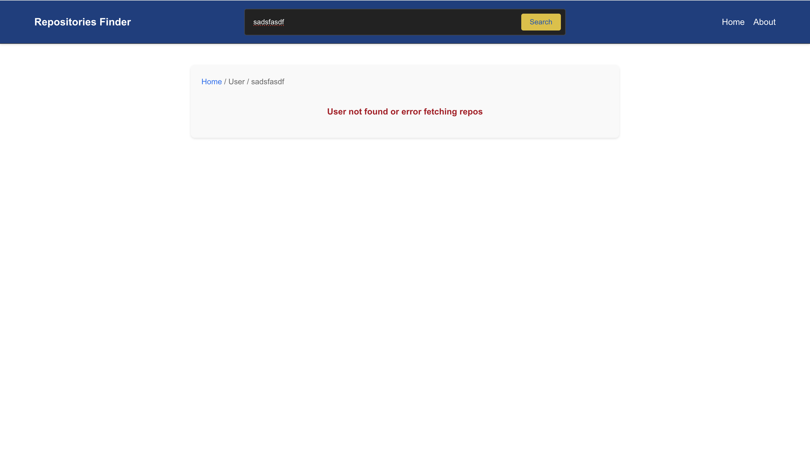

*** REPOSITORIES FINDER ***

* Input username
* Show user projects / repositories
* Readme Reader 
* Breadcrumbs navigasi
* Error handling if user/readme not found
* used CSS Custom

---

### `README.md`

````md
# 🔍 GitHub Repositories Finder

A simple Next.js app to browse public repositories from any GitHub username.  
Built with modern React features and clean UI using Custom CSS

---
## Features

- Search GitHub users by username
- List public repositories for the user
- Display README content of selected repository
- Pure CSS styling (no frameworks like Tailwind/Bootstrap)
- Clean component structure and state management
- Responsive design for mobile & desktop

---

## Tech Stack

| Tool          | Description                              |
|---------------|------------------------------------------|
| **Next.js**   | Framework for server-rendered React apps |
| **HeroIcon** | beautiful icon                           |
| **TypeScript**| Strongly-typed JavaScript                |
| **CSS Modules** | Custom CSS without any framework       |
| **GitHub REST API** | Fetch user and repo data from GitHub |
| **React Context API** | Lightweight state management     |

---

## Getting Started

### 1. Clone the repo

```bash
git clone https://github.com/gakimm/repositories-finder.git
cd repositories-finder
````

### 2. Install dependencies

```bash
npm install
# or
yarn
```

### 3. Run the dev server

```bash
npm run dev
```

Open [http://localhost:3000](http://localhost:3000) to see it in action.
---

## 📷 UI Preview

> Home
> 

> About
> 

> User Repo List
> 

> User Repo Readme.md reader
> 

> User not found
> 

> User Repo Readme.md reader
> 

---

## 📄 License

MIT — free to use and modify.

---

## Acknowledgements

* GitHub REST API
* Next.js team
* Heroicons for icons

---

Feel free to fork and enhance the project! Pull requests are welcome

```
---